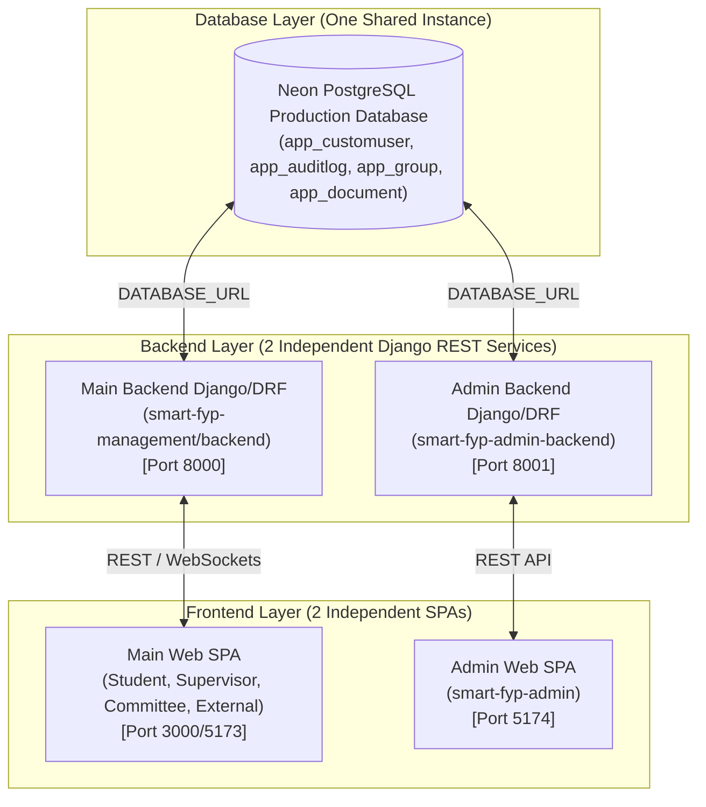

# SMART FYP MANAGEMENT SYSTEM — ADMIN BACKEND ARCHITECTURE

**Institution**: University of Transport and Communications (UTC)  
**Architecture**: 2 Frontends + 2 Backends + 1 Shared Neon PostgreSQL Database  
**Audit Date**: August 18, 2026  

---

## 1. Multi-Tier System Topology Diagram

---

## 2. Component Separation & Responsibilities

| Component | Repository Path | Tech Stack | Port / Target | Responsibilities |
| :--- | :--- | :--- | :---: | :--- |
| **Shared Database** | Cloud Host (Neon) | PostgreSQL | `5432` | Single Source of Truth for Users, Groups, Documents, Audit Logs |
| **Main Backend** | `smart-fyp-management/backend` | Django 5 DRF + Channels | `8000` | Student, Supervisor, Committee, External APIs & WebSockets |
| **Main Frontend** | `smart-fyp-management/frontend` | React 18 + Vite | `3000` | Primary Portal for Academic Users |
| **Admin Backend** | `smart-fyp-admin-backend` | Django 5 DRF | `8001` | Admin Auth, User Management, Security Center, Audit Logs |
| **Admin Frontend** | `smart-fyp-admin` | React 18 + Vite | `5174` | Enterprise Administrator Management Portal |
